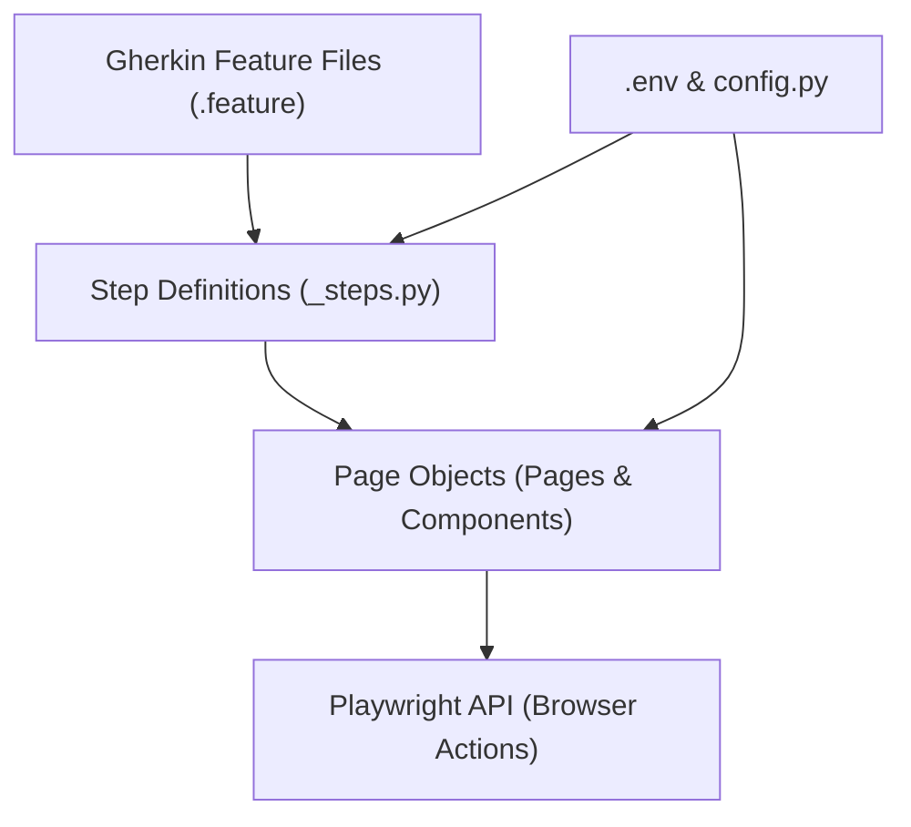

# QA Automation Mindset & Engineering Principles

This document outlines the core engineering philosophy, architectural decisions, and QA strategies guiding the design and development of our OrangeHRM BDD automation framework.

---

## 💡 1. QA Thinking
Test automation is not simply about translating manual clicks into code; it is about simulating realistic system states and validating business integration. 
*   **Dynamic Dependency Resolution**: In OrangeHRM, a System User requires a valid, pre-existing employee. Rather than hardcoding employee names (which causes test fragility when data is deleted or altered on public sandboxes), our framework starts by dynamically creating a new employee in the PIM module, capturing their name, and utilizing it in the Admin user creation form.
*   **State Verification**: We do not stop at form submissions. The framework performs grid search verification to confirm that the database has updated correctly and that the user's role and status are active in the table.

---

## ⚙️ 2. Automation Mindset
Our approach focuses on building a highly resilient, self-contained automation ecosystem that minimizes manual intervention and setup:
*   **Self-Sustaining Test Cycles**: Tests generate their own prerequisite data and clean up or isolate their runtime variables.
*   **Collision Prevention**: We generate unique credentials using UUID sequences (`f"user_{uuid.uuid4().hex[:6]}"`) for each test execution, allowing tests to run multiple times in parallel without credentials colliding.
*   **Self-Healing Locators**: Embedded AI-powered healing. If a locator breaks during minor page changes, Google Gemini resolves it at runtime, allowing the suite to finish executing and reducing manual script updates.

---

## 📐 3. Framework Structure
The project is built on a clean, modular Python-based BDD architecture, separating concerns into distinct layers:



*   **Behavioral Specifications (`features/`)**: High-level business scenarios written in readable Gherkin syntax.
*   **Step Definitions (`features/steps/`)**: Maps Gherkin steps to code, directing page object actions and making assertions.
*   **Page Object Model (`features/pages/`)**: Encapsulates all locator selectors and page-specific interactions (e.g. form filling, navigation).
*   **Configuration (`config/` & `.env`)**: Centralized runtime variables (timeouts, credentials, browser configurations).

### Directory & File Structure
```text
orange/
├── config/
│   └── config.py                 # Configuration manager loads env vars
├── features/
│   ├── pages/                    # Page Objects (POM locators & actions)
│   │   ├── admin_page.py
│   │   ├── base_page.py
│   │   ├── login_page.py
│   │   └── ...
│   ├── steps/                    # Behave Gherkin step definitions
│   │   ├── login_steps.py
│   │   ├── user_management_steps.py
│   │   └── ...
│   ├── environment.py            # Global hooks, browser contexts & scenario retries
│   ├── login.feature             # Smoke login scenarios
│   ├── user_management.feature   # System User E2E creation scenarios
│   └── ...
├── logs/                         # Execution logs generated per feature file
├── reports/                      # Allure reports, failure videos, tracer zips
├── utils/                        # Shared helpers (logger, API clients)
├── .env                          # Local environment variables configuration
├── .env.example                  # Template configuration file for development
├── pyproject.toml                # Project configurations & dependency scopes
├── README.md                     # Setup instructions & test tag guide
├── run_tests.py                  # Main sequential/parallel runner (with rerun capability)
└── setup.bat                     # Automated script for environment initialization
```

---

## 🎨 4. Code Readability and Maintainability Approach
A test suite must be as readable and maintainable as the production code it tests:
*   **DRY (Don't Repeat Yourself) Selectors**: Shared interactions (like autocomplete suggestion clicks, status dropdown option selection, or waiting for success toasts) are written as centralized helper methods within the base or specific page objects.
*   **Self-Documenting Code**: Avoided cryptic method names and variables. Step definitions and page methods use verbose, descriptive names.
*   **Structured Logging**: Utilized a unified logging utility (`utils/logger.py`) to log step actions, API requests, and browser status. This provides clear debug outputs in log files without cluttering console reports.

---

## 🛠️ 5. Engineering Decisions
*   **Playwright over Selenium**: We selected Playwright Python for its modern execution engine. It provides auto-wait mechanisms, built-in browser context isolation, fast execution speeds, and excellent tooling (like execution video recording, screenshots, and tracer zips).
*   **GIL-Bypassing Parallel Execution**: Instead of running behave in a single-threaded runner (which is bottlenecked by Python's Global Interpreter Lock), we built a custom parallel runner `run_tests.py` that spawns feature files in concurrent subprocesses, optimizing execution speeds.
*   **Targeted Failing Reruns**: Implemented a custom `--rerun` command-line flag that saves failing scenario coordinates to `rerun_failed.features` and executes only those failing targets on subsequent runs, speeding up developer verification loops.

---

## 🏷️ 6. Test Classification Strategy
To maintain speed, coverage, and confidence, tests are tagged and classified into three tiers:
*   **`@smoke`**: Core workflows verifying general system health (e.g., successful login/logout, simple employee searches). Designed to run on every commit or post-deployment, completing within 2 minutes.
*   **`@regression`**: Detailed boundary, negative validation form inputs, and edge-case scenarios. Runs nightly or pre-release to guarantee deep system health.
*   **`@SIT` (System Integration Testing)**: Multi-stage integration scenarios that verify data flow and dependency between multiple OrangeHRM modules (e.g., PIM employee creation to Admin system user creation).
